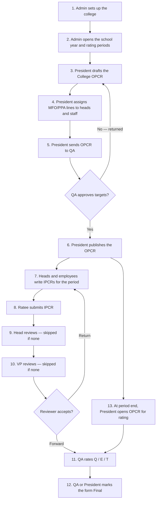

# OCC PMS — System Flow

Opol Community College Performance Management System (OPCR / IPCR).

This document describes **who does what**, in order, from a fresh school year through rating. The demo seeder creates **16 accounts**. Every seeded password is `password`.

---

## 1. Roles (6)

| Order | Role | Label in UI | How many (seeded) | Job in one line |
| --- | --- | --- | ---: | --- |
| 1 | `admin` | Administrator | 1 | Set up the college: people, offices, school year, workflow |
| 2 | `president` | President | 1 | Write and publish the college OPCR; assign work downward |
| 3 | `qa` | Quality Assurance | 1 | Approve OPCR targets; rate every form (Q / E / T) |
| 4 | `vp` | Vice President | 1 | Own an IPCR; review forms from offices they oversee |
| 5 | `program_head` | Head | 5 | Own an IPCR; review their team's IPCRs; break work into lines |
| 6 | `employee` | Employee | 7 | Write and submit their own IPCR |

**Total seeded users: 16**

An administrator can create more accounts later. Admin is excluded from being assigned OPCR work.

---

## 2. Demo accounts

| Role | Name | Email | Office |
| --- | --- | --- | --- |
| Administrator | System Administrator | `admin@occ.edu.ph` | Opol Community College |
| President | Neilson D. Bation, DM | `president@occ.edu.ph` | Opol Community College |
| QA | Dr. Wenie Rose D. Canay | `qa@occ.edu.ph` | Opol Community College |
| VP | Dr. Alma T. Gurrea | `vpial@occ.edu.ph` | Opol Community College |
| Head | Ronnel D. Pinto | `research.head@occ.edu.ph` | Research and Extension Office |
| Head | Dr. Dolorita N. Arao | `extension.head@occ.edu.ph` | Extension and Community Services |
| Head | Ruben Madriaga | `bsit.head@occ.edu.ph` | BS Information Technology |
| Head | Dr. Rodelia T. Arancon | `library.head@occ.edu.ph` | Library |
| Head | Bernadeth T. Nacua | `registrar@occ.edu.ph` | Office of the Registrar |
| Employee | Juanito R. Demetrio | `demetrio@occ.edu.ph` | Research and Extension Office |
| Employee | Annabelle T. Verula | `verula@occ.edu.ph` | Office of the Registrar |
| Employee | Gaudencio Iyo Jr. | `iyo@occ.edu.ph` | BS Information Technology |
| Employee | Sophomore T. Vacalares | `vacalares@occ.edu.ph` | BS Information Technology |
| Employee | Amabelle Pacana | `pacana@occ.edu.ph` | Office of Instruction |
| Employee | Daceil B. Magnetico | `magnetico@occ.edu.ph` | Office of Instruction |
| Employee | John Rey Puertos | `puertos@occ.edu.ph` | Office of Instruction |

---

## 3. Offices (hierarchy)

The college unit is the parent. Each office can name a **Head** and a **VP** — those two people become the IPCR reviewers for everyone in that office.

```
Opol Community College          (college)
├── Office of Instruction       Head: Ruben Madriaga
├── Research and Extension      Head: Ronnel D. Pinto
├── Extension and Community     Head: Dr. Dolorita N. Arao
├── Library                     Head: Dr. Rodelia T. Arancon
├── BS Information Technology   Head: Ruben Madriaga
├── Office of the Registrar     Head: Bernadeth T. Nacua
└── International Affairs       (no seeded head)
```

All of those offices answer to VP **Dr. Alma T. Gurrea**.

---

## 4. Yearly flow (start here)



Nothing can be filed until an administrator marks a **school year** (and usually a **rating period**) as active.

---

## 5. Administrator

**Menu:** Dashboard · College OPCR · My Forms · Review Queue · Rating · Reports · Setup

Admin can open every role-gated screen. Day-to-day college work still belongs to the president and QA. Setup is the admin's real job.

### Setup order

1. **Accounts** (`/admin/users`) — create people, set role, office, position, active/inactive.
2. **Hierarchy** (`/admin/org-units`) — create offices; assign each office a Head and a VP.
3. **School Years** (`/admin/school-years`) — create the year, add periods (e.g. January–June, July–December), mark one year and one period **active**.
4. **Workflow** (`/admin/workflow`) — who reviews, who may assign work, who may create/publish the OPCR. Defaults live in `config/pms.php`.
5. **Audit Trail** (`/admin/audit`) — who signed in, who changed a form, who assigned a line.

An inactive account cannot sign in.

---

## 6. President

**Menu:** Dashboard · College OPCR · My Forms · Reports

The college writes **one OPCR per year**. The president owns it.

### OPCR lifecycle

```
draft → qa_approval → approved → published → qa_rating → rated → final
                ↘ returned ↗                    ↘ returned ↗
```

| Status | Who moves it | What it means |
| --- | --- | --- |
| Draft | President | Write MFO/PPAs (Strategic / Core / Support) and success indicators |
| For QA approval | President sends it | QA checks the *targets*, not the ratings yet |
| Approved | QA | Targets are accepted; not yet visible college-wide |
| Published | President | Visible. Other people's IPCRs may now point at these lines |
| With QA | President opens rating at period end | QA scores the OPCR itself |
| Rated | QA | Scores are in; not closed |
| Final | QA or President | Closed |
| Returned | QA | Back to the president to correct |

### Assignment (cascade)

Once lines exist, the president hands work down. Assignment **writes the line into the other person's IPCR** so the link cannot be forgotten.

| Who | May assign |
| --- | --- |
| President | Whole MFO/PPA headings **and** individual indicators |
| VP, Head | Individual indicators only |
| Employee | Nothing — they deliver the line |

The president does not file a personal IPCR. The college OPCR *is* the president's document.

---

## 7. Quality Assurance

**Menu:** Dashboard · Rating · Reports

QA has two jobs, at two different times.

1. **Approve OPCR targets** before the year starts (draft → approved).
2. **Rate forms** after work is done:
   - every submitted IPCR that reached `qa_rating`
   - the published OPCR once the president opens it for rating

### Rating instrument

Each success indicator is scored **1–5** on:

- **Q** Quality
- **E** Efficiency
- **T** Timeliness

The three scores average to **A**. Adjectival bands:

| Average | Printed rating |
| ---: | --- |
| 4.5 – 5.0 | Outstanding |
| 3.5 – 4.49 | Very Satisfactory |
| 2.5 – 3.49 | Satisfactory |
| 1.5 – 2.49 | Unsatisfactory |
| below 1.5 | Poor |

QA may return a form instead of rating it. After rating, QA (or the president) marks it **Final**.

---

## 8. Vice President and Head

**Menu:** Dashboard · My IPCR · My Forms · My Team · Review Queue

They wear two hats.

### As ratees

They write their own IPCR for the active rating period (`/my-ipcr`), same as an employee.

A VP sitting in the college unit often has **no head and no VP above them**, so submit goes **straight to QA**.

A head's IPCR is reviewed by the office VP, then QA.

### As reviewers

- **My Team** — people in offices they head or oversee.
- **Review Queue** — IPCRs waiting on them (`head_review` or `vp_review`).

They may **accept** (forward to the next stage) or **return** (back to draft/returned for the writer).

They may also assign **indicators** to people below them, which seeds those lines on the assignee's IPCR.

---

## 9. Employee

**Menu:** Dashboard · My IPCR · My Forms

Employees only write and submit their own IPCR.

### IPCR lifecycle

```
draft → head_review → vp_review → qa_rating → rated → final
  ↑         │              │           │
  └─────────┴──────────────┴───────────┘  any reviewer may return it
```

A stage is **skipped** when that reviewer slot is empty, or when the reviewer would be the ratee themselves.

Typical path for a faculty member in BSIT:

1. Write IPCR (commitments often already seeded from the OPCR cascade).
2. Record accomplishments and attach evidence (images, PDF, Office files; 5 MB max).
3. Submit → **Head** (Program Head) → **VP** → **QA rates** → Final.

IPCRs are **per rating period**. The OPCR is **per school year**.

---

## 10. What each role sees

| Screen | Admin | President | QA | VP | Head | Employee |
| --- | :---: | :---: | :---: | :---: | :---: | :---: |
| Dashboard | ✓ | ✓ | ✓ | ✓ | ✓ | ✓ |
| College OPCR | ✓ | ✓ | | | | |
| My IPCR | | | | ✓ | ✓ | ✓ |
| My Forms | ✓ | ✓ | | ✓ | ✓ | ✓ |
| My Team | | | | ✓ | ✓ | |
| Review Queue | ✓ | | | ✓ | ✓ | |
| Rating | ✓ | | ✓ | | | |
| Reports | ✓ | ✓ | ✓ | | | |
| Setup (accounts, offices, years, workflow, audit) | ✓ | | | | | |
| Profile / Notifications | ✓ | ✓ | ✓ | ✓ | ✓ | ✓ |

Admin can open any of these even when the sidebar hides them from other roles.

---

## 11. Form structure (both OPCR and IPCR)

1. **Form** — OPCR (office / college, whole year) or IPCR (one person, one period).
2. **Output** — MFO / PPA heading, under Strategic, Core, or Support.
3. **Indicator** — one success measure, with target date and progress.
4. **Accomplishment + attachments** — what was actually done.
5. **Rating** — QA's Q / E / T scores on that line.

Comments and mentions sit on the form. Status changes are logged.

---

## 12. Sign-in

- URL: `/login`
- API: `POST /api/login` issues a Passport access token.
- Seeded password for all 16 accounts: **`password`**

Start as **admin** to confirm Setup, then **president** to run the OPCR, then a **head** or **employee** to see an IPCR, then **QA** to rate.
